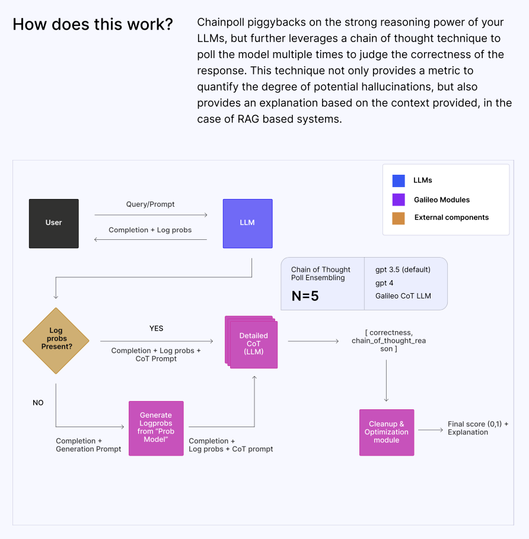

# 🌟 LLM Hallucination Index - RAG Special 🌟

  

  <a href="https://galileo.ai/hallucination-index">https://galileo.ai/hallucination-index</a>

# About the Index

  

# Attributes Tested

There were two key LLM attributes we wanted to test as part of this Index - context length and open vs. closed-source.

## Context Length

With the rising popularity of RAG, we wanted to see how context length affects model performance. Providing an LLM with context data is akin to giving a student a cheat sheet for an open-book exam. We tested three scenarios:

| Context Length | Task Description |
| -------------- | ----------- |
| Short Context  | Provide the LLM with < 5k tokens of context data, equivalent to a few pages of information. |
| Medium Context | Provide the LLM with 5k - 25k tokens of context data, equivalent to a book chapter. |
| Long Context   | Provide the LLM with 40k - 100k tokens of context data, equivalent to an entire book. |

## Open vs. Closed Source

The open-source vs. closed-source software debate has waged on since the Free Software Movement (FSM) in the late 1980s. This debate has reached a fever pitch during the LLM Arms Race. The assumption is closed-source LLMs, with their access to proprietary training data, will perform better, but we wanted to put this assumption to the test.

## Prompting Techniques

We experimented with a prompting technique known as Chain-of-Note, which has shown promise for enhancing performance in short-context scenarios, to see if it similarly benefits medium and long contexts.

# Models Evaluated

We tested 22 models, 10 closed-source models and 12 open-source models, from leading foundation model brands like OpenAI, Anthropic, Meta, Google, Mistral, and more.

  

# Major Trends

  

# Overall Winners

  

# Short Context RAG Insights

  

# Medium Context RAG Insights

  

# Long Context RAG Insights

  

# Methodology

## Short Context RAG (SCR)

We evaluated SCR using a rigorous set of datasets to test the model's robustness in handling short contexts. One of our key methodologies was Chainpoll with GPT-4o. This involves polling the model multiple times using a chain of thought technique, allowing us to:

1. Quantify potential hallucinations.
2. Offer context-based explanations, a crucial feature for RAG systems.

## Medium and Long Context RAG (MCR & LCR)

Our focus here was on assessing models’ ability to comprehensively understand extensive texts in medium and long contexts. The procedure involved:

- Extracting text from 10,000 recent documents of a company.
- Dividing the text into chunks and designating one as the "needle chunk."
- Constructing retrieval questions answerable using the needle chunk embedded in the context.

### Context Lengths Evaluated

- **Medium**: 5k, 10k, 15k, 20k, 25k tokens
- **Long**: 40k, 60k, 80k, 100k tokens

### Task Design Considerations

1. All text in context must be from a single domain.
2. Responses should be correct even with short context, confirming the influence of longer contexts.
3. Questions should not be answerable from pre-training memory or general knowledge.
4. Measure the influence of information position by keeping everything constant except the location of the needle.
5. Avoid standard datasets to prevent test leakage.

### Effect of Prompting Technique on Performance

We experimented with a prompting technique known as Chain-of-Note, which has shown promise for enhancing performance in short-context scenarios, to see if it similarly benefits medium and long contexts.

### Evaluation

Adherence to context was evaluated using a custom LLM-based assessment, checking for the relevant answer within the response.

# Hallucination Detection

To evaluate a model’s propensity to hallucinate, we employed a high-performance evaluation technique to assess contextual adherence and factual accuracy. Learn more about Galileo’s [Context Adherence](https://www.rungalileo.io/research) and [ChainPoll](https://www.rungalileo.io/blog/chainpoll).

  

# Inner Working of ChainPoll

  

# About Galileo

  

# Get the Full Report with More Insights 🌟

For an in-depth understanding, we recommend checking out [https://www.rungalileo.io/hallucinationindex](https://www.rungalileo.io/hallucinationindex).
